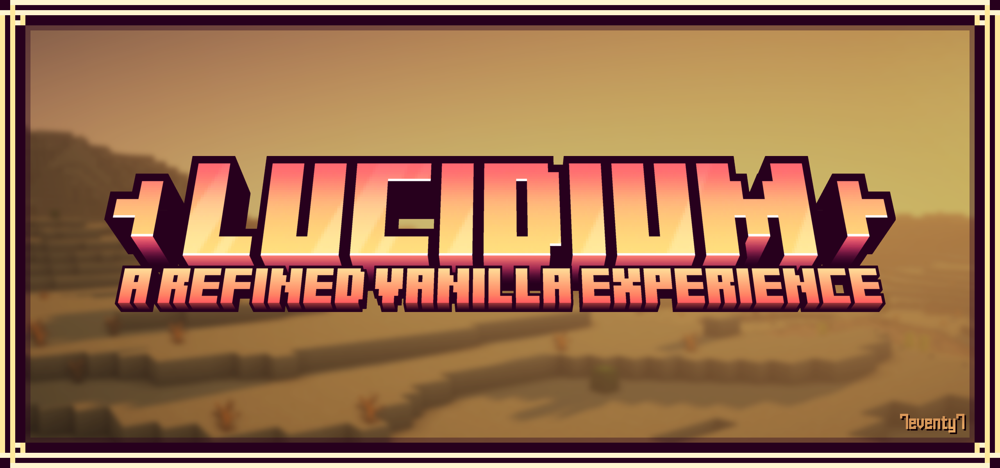
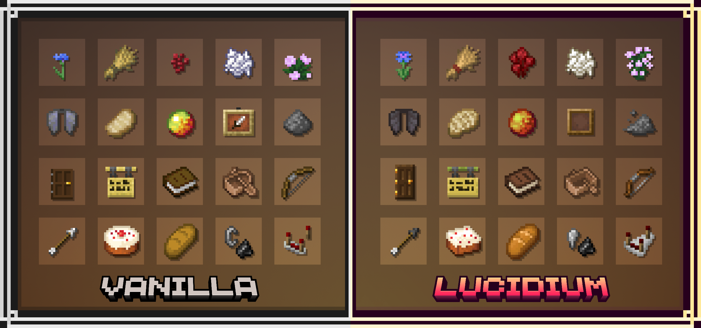
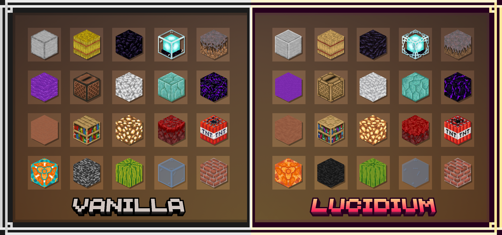
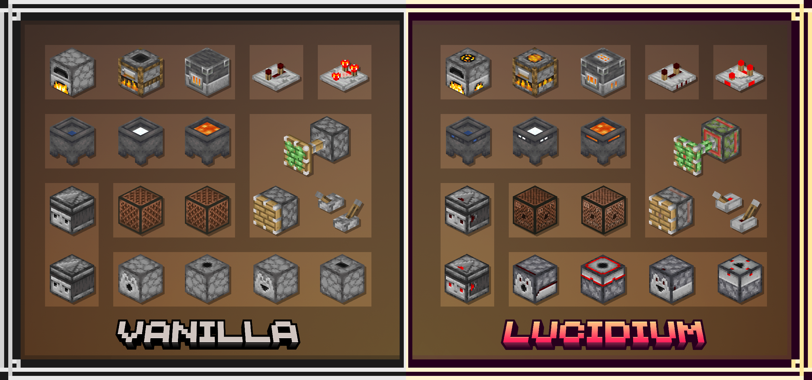
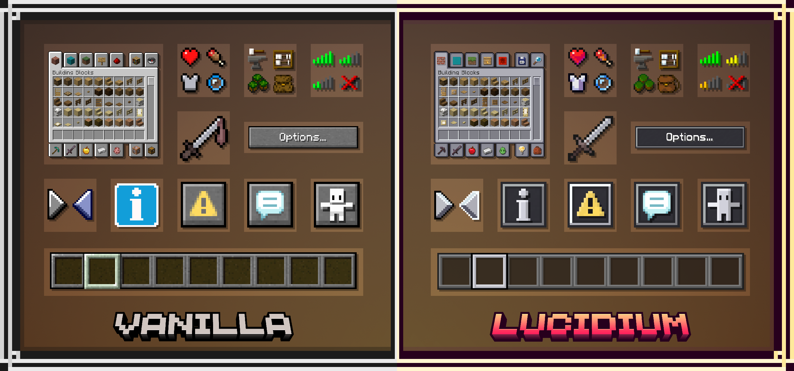
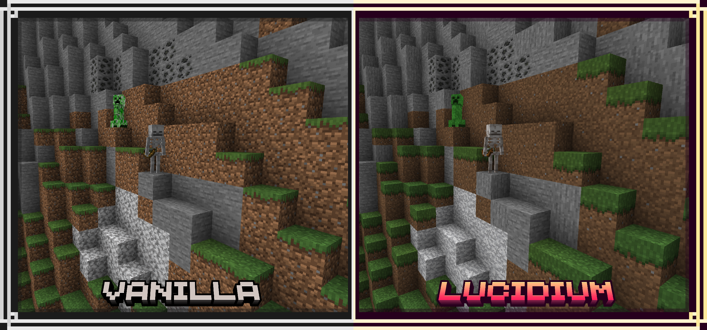
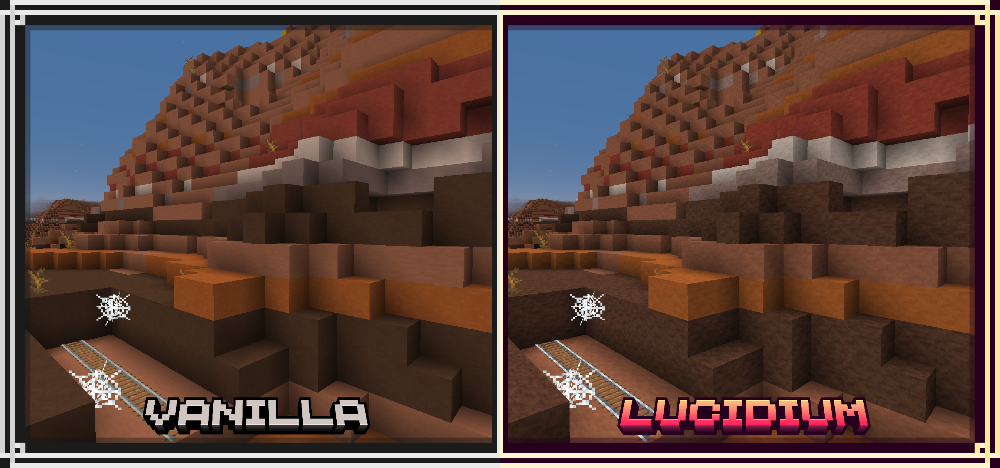
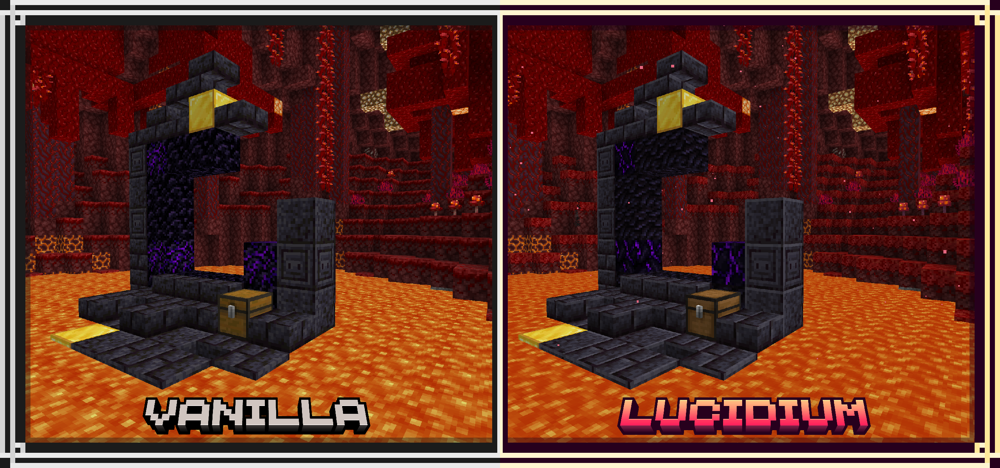
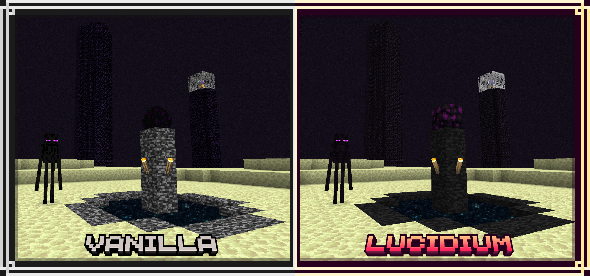
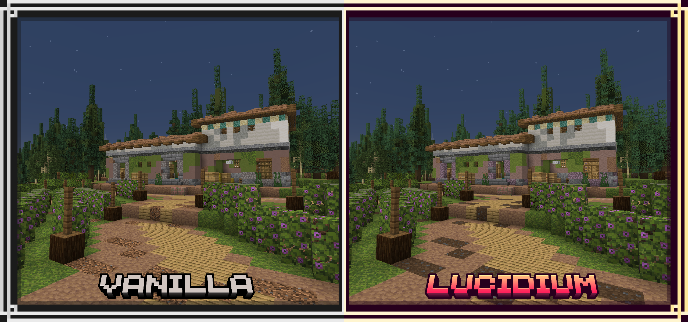

  
  <a href="https://github.com/7eventy7/Lucidium" style="display: inline-block; padding: 4px 12px; color: #FF6B71; text-decoration: none; border: 1px solid #FF6B71; border-radius: 4px; font-size: 12px;">BACK</a>

> A comparative gallery of images showing the changes in Lucidium.

