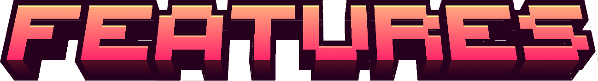

[ Download from Modrinth](https://modrinth.com/resourcepack/lucidium)

[ Download from PlanetMinecraft](https://www.planetminecraft.com/texture-pack/lucidium/)

[ Download from CurseForge](https://www.curseforge.com/minecraft/texture-packs/lucidium)

Lucidium is a vanilla-like resource pack of tweaked assets, improvements to outdated textures, simplicity changes and parity fixes with the mission of maintaining the core feeling of the game throughout. With a focus on streamlining redstone design, the pack introduces new blockstate textures for various components, making complex contraptions simpler to create. Outdated textures have been refined, and inconsistencies have been addressed to ensure a cohesive and visually pleasing experience. Most of the default textures have not been altered to ensure that the base feel of the game we all love still shines through the various improvements. Every single change made in this pack, no matter how small, was meticulously toiled over until the perfect aesthetic was achieved. A reasonable amount of the textures, models, and artwork featured in this pack were not made by me; most of the assets that are changed have been heavily edited and curated to ensure consistency with the vanilla Minecraft experience.

  
  <a href="https://github.com/7eventy7/Lucidium/blob/main/FEATURES.md" style="display: inline-block; padding: 4px 12px; color: #FF6B71; text-decoration: none; border: 1px solid #FF6B71; border-radius: 4px; font-size: 12px;">VIEW</a>

> A fully fledged feature list describing everything that is included in the resource pack. All features are organized into categories based on what they change about the game. The list *should* be fully complete, however, if you notice any inconsistencies please raise an issue.

  
  <a href="https://github.com/7eventy7/Lucidium/blob/main/GALLERY.md" style="display: inline-block; padding: 4px 12px; color: #FF6B71; text-decoration: none; border: 1px solid #FF6B71; border-radius: 4px; font-size: 12px;">VIEW</a>

> View side-by-side comparison images showcasing changes made by the resource pack. You can also see how these visual updates look within Minecraft scenes that you'd typically find in game.

  
  <a href="https://github.com/7eventy7/Lucidium/blob/main/CREDITS.md" style="display: inline-block; padding: 4px 12px; color: #FF6B71; text-decoration: none; border: 1px solid #FF6B71; border-radius: 4px; font-size: 12px;">VIEW</a>

> Lucidium features assets from various resource packs and creators, with explicit permission received from each. Full attribution for all assets and software used can be found in the credits file.

  
  <a href="https://github.com/7eventy7/Lucidium/blob/main/LICENSE.md" style="display: inline-block; padding: 4px 12px; color: #FF6B71; text-decoration: none; border: 1px solid #FF6B71; border-radius: 4px; font-size: 12px;">VIEW</a>

> Before using any assets from Lucidium, please message me for permission and obtain approval from any other credited creators whose assets you intend to use. All content is protected under Creative Commons Attribution-NonCommercial-ShareAlike 4.0 International license terms.

© 2024 7eventy7 | Some Rights Reserved | CC BY-NC-SA 4.0